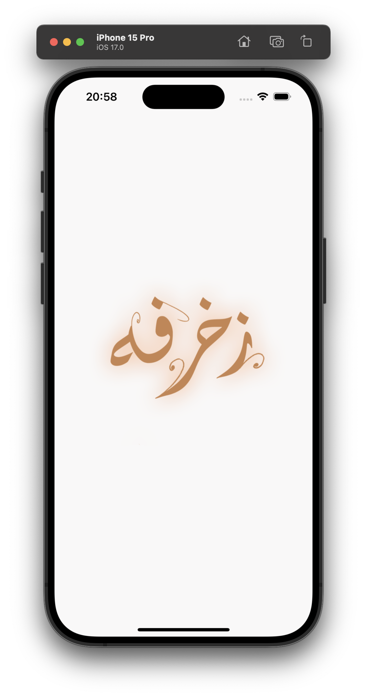
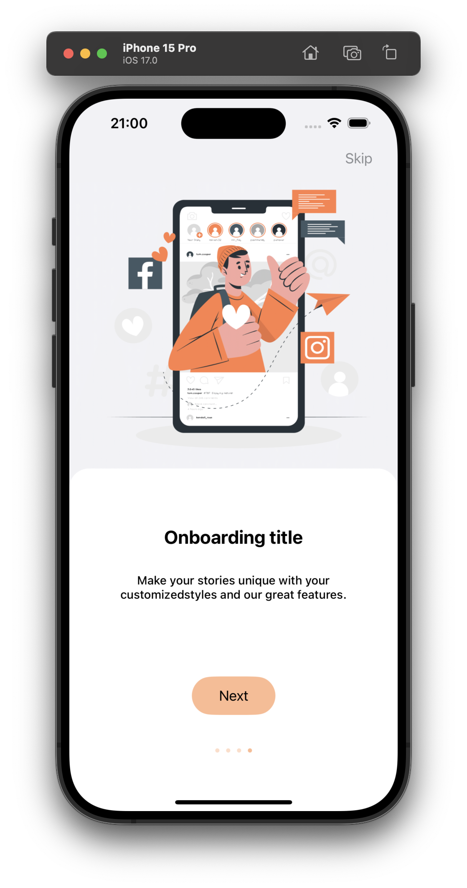
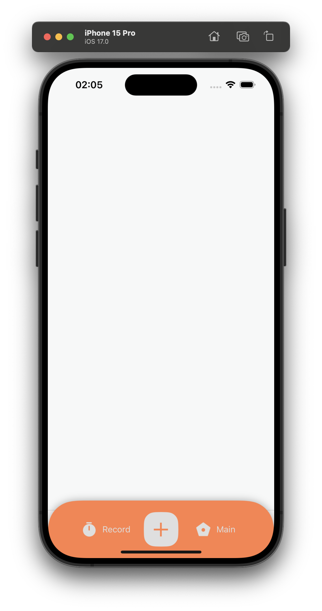
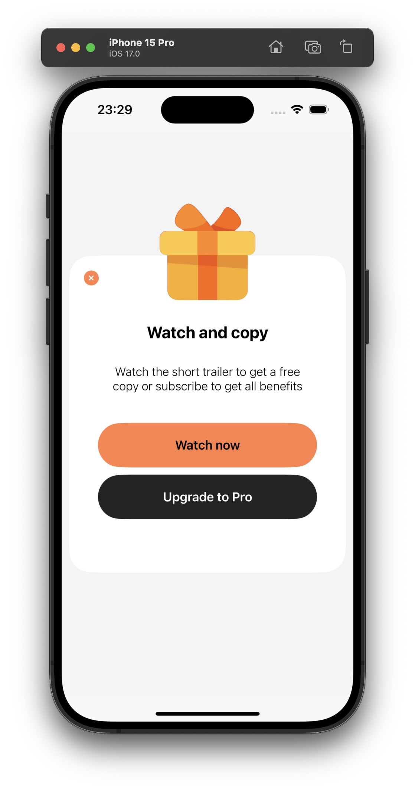
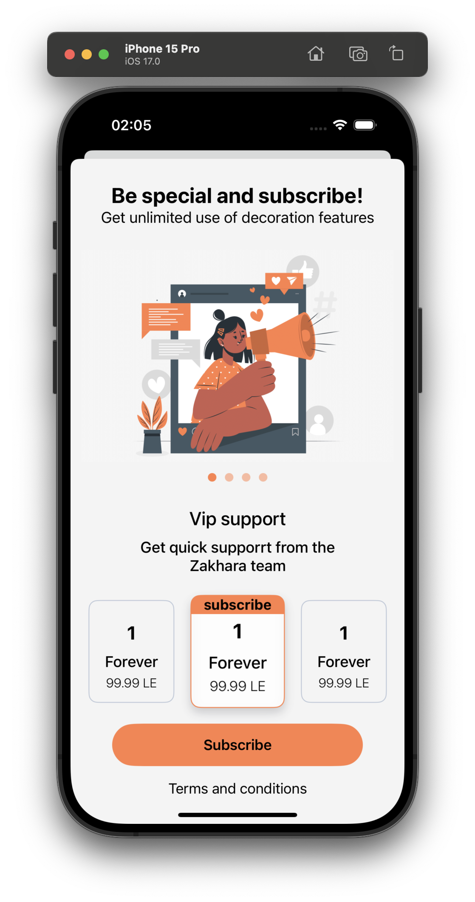

# Zakhrpha iOS

**Version:** 1.0.0

## Todo List

1. [ ]  **AppIcon**

1. [ ]  **on boarding**      
    - About app
    - Video
    - inApp purchase
                               
2. [ ]  **Main function**
    - Main page
    - text decoration
    - names
    - shapes
    - Symboles
    - favorite
    - home
    - history
                         
3. [ ]  **ads Types**
    - banner ad
    - rewarded ad
    - return ad
    
4. [ ]  **user types**
    - non subscriber user 
    - subscriber user
  
5. [ ]  **subscribtion types** 
    - monthly
    - yearly
    - lifetime
                       
6. [ ]  **setting Menue**
    - language
    - appearance
    - help
    - check our App

## Screenshots & Videos

 
    
      

  

    
    

  

    
    

  

## Frameworks and dependencies

Swift/SwiftUI 
